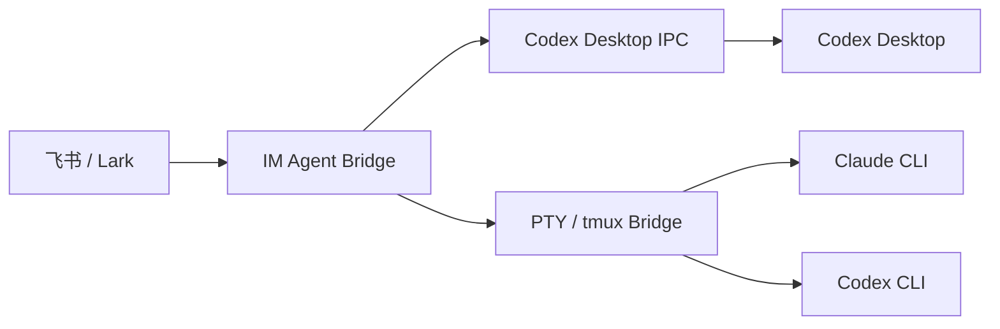

<div align="center">

<h1>im-agent-bridge</h1>

<p><strong>Control Codex, Claude, and other desktop AI agents remotely from Lark and messaging platforms.</strong></p>

<p>在你常用的即时通讯工具中，实时查看并控制本机 AI Agent。</p>

[](./LICENSE)
[](https://www.python.org/)
[](#支持矩阵)
[](https://open.feishu.cn/)

</div>

## 简介

`im-agent-bridge` 将本机运行的 AI 编程 Agent 接入飞书。离开电脑后，你仍可以在
手机上查看实时进度、继续发送指令、处理交互请求，并在不同会话之间切换。

当前版本已经支持直接控制 **Codex Desktop GUI 任务**，同时保留 Claude CLI 与
Codex CLI 的终端桥接能力。项目采用可扩展方向设计，后续可继续接入 Claude Desktop
和其他即时通讯平台。

> [!IMPORTANT]
> 当前只实现了 Codex Desktop 的 GUI 直连。Claude Desktop 与其他 IM 平台仍在
> Roadmap 中，请勿将它们视为已经可用的功能。

## 核心能力

- **Desktop 原生任务控制**：直接跟随 Codex Desktop 现有任务，不启动第二个 CLI，
  不抢占 writer lock。
- **双向实时通信**：空闲任务开始新 turn，运行中任务通过 steer 追加消息。
- **单卡片持续更新**：进度、最终回复、运行状态在同一张飞书卡片中刷新。
- **会话快速定位**：按项目名、完整工作目录和 Session ID 展示 Desktop 任务。
- **分页任务列表**：每页显示 5 个任务，可在卡片内前后翻页。
- **交互处理**：支持停止任务、命令审批、权限审批和用户输入。
- **CLI 兼容模式**：继续支持 Claude CLI、Codex CLI 与 tmux 会话。

## 支持矩阵

| Agent / 渠道 | 接入方式 | 平台 | 状态 |
|---|---|---|---|
| Codex Desktop + 飞书 | 本机 owner/follower IPC | macOS | ✅ 已支持 |
| Claude CLI + 飞书 | PTY / tmux | macOS、Linux | ✅ 已支持 |
| Codex CLI + 飞书 | PTY / tmux | macOS、Linux | ✅ 已支持 |
| Claude Desktop | 待设计 | — | 🧭 Roadmap |
| Slack、钉钉、企业微信等 | IM Adapter | — | 🧭 Roadmap |

## 快速开始

### 1. 安装

```bash
git clone https://github.com/CCpoe/im-agent-bridge.git
cd im-agent-bridge
./init.sh
```

安装脚本会检查 `uv`、`tmux` 等依赖，并安装 `remote-claude`、`cla`、`cl`、
`cx` 和 `cdx` 命令。

> npm 包名和 `remote-claude` CLI 名称为兼容现有安装与脚本而保留；GitHub 仓库与
> 项目品牌为 `im-agent-bridge`。

### 2. 配置飞书机器人

使用向导创建或配置企业自建应用：

```bash
remote-claude lark init
```

如果已经有飞书应用，也可以在 `~/.remote-claude/.env` 中填写：

```dotenv
FEISHU_APP_ID=cli_xxxxx
FEISHU_APP_SECRET=xxxxx
```

请在飞书开放平台为应用启用机器人能力、事件订阅和所需权限，并发布一个可用版本。

### 3. 启动

```bash
remote-claude lark start
remote-claude lark status
```

随后在飞书中找到机器人并发送：

```text
/desktop
```

任务列表会展示项目、Session ID、工作目录和更新时间。点击“进入”后，即可通过普通
飞书消息或卡片输入框继续该 Desktop 任务。

## 飞书命令

### Codex Desktop

| 命令 | 说明 |
|---|---|
| `/desktop` | 分页列出所有 Codex Desktop 任务，每页 5 个 |
| `/desktop <session-id>` | 连接指定 Desktop 任务 |
| `/desktop <codex://threads/...>` | 使用完整任务链接连接 |
| `/desktop-status` | 刷新当前 Desktop 状态卡片 |
| `/desktop-stop` | 停止当前 turn |
| `/desktop-detach` | 停止跟随，Desktop 任务继续运行 |

### CLI 会话

| 命令 | 说明 |
|---|---|
| `/menu` | 打开快捷操作面板 |
| `/list` | 查看 Claude/Codex CLI 会话 |
| `/attach <name>` | 连接已有 CLI 会话 |
| `/detach` | 断开当前会话 |
| `/start <name> [path]` | 启动新会话 |
| `/kill <name>` | 终止会话 |
| `/status` | 查看连接状态 |
| `/help` | 查看帮助 |

## 本地快捷命令

| 命令 | 说明 |
|---|---|
| `cla` | 启动 Claude CLI，会话名取当前目录 |
| `cl` | 同 `cla`，跳过权限确认 |
| `cdx` | 启动 Codex CLI，需要确认权限 |
| `cx` | 启动 Codex CLI，跳过权限确认 |
| `remote-claude` | 完整管理命令，保留旧名称以兼容现有脚本 |

## 工作原理



Codex Desktop 模式通过本机 owner/follower IPC 获取任务状态并发送操作；CLI 模式通过
PTY、tmux 和共享内存同步终端内容。飞书侧使用 CardKit 卡片承载状态与交互。

## 配置

默认配置文件位于 `~/.remote-claude/.env`：

| 配置项 | 默认值 | 说明 |
|---|---|---|
| `FEISHU_APP_ID` | — | 飞书应用 ID |
| `FEISHU_APP_SECRET` | — | 飞书应用密钥 |
| `ENABLE_USER_WHITELIST` | `false` | 是否启用用户白名单 |
| `ALLOWED_USERS` | — | 允许使用的飞书用户 ID，逗号分隔 |
| `CLAUDE_COMMAND` | `claude` | Claude CLI 启动命令 |
| `CODEX_DESKTOP_IPC_PATH` | `~/.codex/ipc/ipc.sock` | Codex Desktop 本机 IPC socket |

## 安全与兼容性

- 飞书凭据只保存在本机 `~/.remote-claude/.env`，该文件不会提交到 Git。
- Desktop 模式只连接当前用户的本机 Unix socket，不开放公网监听端口。
- 项目不默认向第三方发送遥测；本地使用统计保存在 `~/.remote-claude/`。
- Codex Desktop IPC 是私有且版本耦合的协议。当前验证版本为 `26.814.41407`；
  Desktop 升级后建议先运行只读联调。
- 超大线程无法传输完整 snapshot 时，会从本地 rollout 建立公开消息基线，再消费
  白名单内的 IPC 增量。
- 文件修改审批为避免盲批，目前只能在飞书拒绝；允许修改请回到 Desktop 操作。

## 开发

运行 Desktop 桥接相关测试：

```bash
UV_PYTHON=3.13 PYTHONPATH=. uv run --with pytest --with pytest-asyncio \
  python3 -m pytest -q \
  tests/test_desktop_ipc.py \
  tests/test_desktop_card.py \
  tests/test_desktop_bridge.py \
  tests/test_desktop_lark_integration.py \
  tests/test_option_select.py
```

更多资料：

- [飞书客户端指南](./LARK_CLIENT_GUIDE.md)
- [Desktop Bridge 测试计划](./TEST_PLAN.md)
- [项目开发说明](./CLAUDE.md)

## Roadmap

- [x] Codex Desktop + 飞书双向控制
- [x] Claude CLI / Codex CLI + 飞书
- [ ] Claude Desktop 适配
- [ ] 标准化 Agent Desktop Adapter
- [ ] Slack、钉钉、企业微信等 IM Adapter
- [ ] Web 管理界面与多设备状态

## 致谢

`im-agent-bridge` 演进自
[yyzybb537/remote_claude](https://github.com/yyzybb537/remote_claude)。感谢原作者和
所有贡献者打下的基础，使 Claude/Codex CLI 的飞书远程协作成为可能。

## License

[MIT](./LICENSE)
